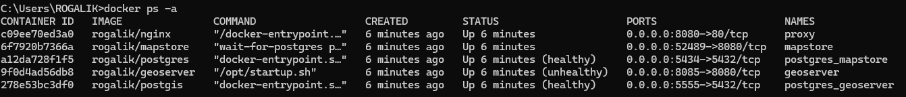
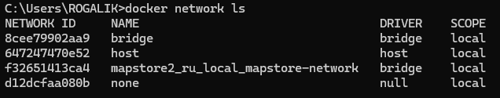
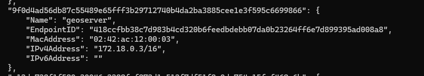

# Docker образ для MapStore 2

## Описание

Этот репозиторий содержит Dockerfile и необходимые файлы для создания Docker образа MapStore 2. MapStore 2 - это современная геопространственная платформа, предназначенная для создания и публикации интерактивных карт и геоинформационных приложений.

## Использование

### MapStore2

- Склонируйте репозиторий:
    ```commandline
    git clone -b docker_compose https://github.com/VladislavGolubtsov/mapstore2_ru_local.git
    ```
- Перейдите в папку репозитория:
    ```commandline
    cd mapstore2_ru_local
    ```
- Для сборки образа и запуска контейнера выполните:
    ```commandline
    docker-compose up -d
    ```
После того как контейнер запустился, перейдите на сайт http://localhost:8080/mapstore/ для проверки работоспособности (для входа в личный кабинет используйте логин: `admin`, пароль `admin`).

### GeoServer

- Загрузите из Docker Hub образ geoserver:
    ```commandline
    docker pull docker.osgeo.org/geoserver:2.24.1
    ```
- Запустите Docker образ GeoServer:
    ```commandline
    docker run -d -p 8081:8080 docker.osgeo.org/geoserver:2.24.1
    ```
Когда контейнер будет запущен, перейдите на сайт http://localhost:8081/geoserver/web для проверки работоспособности GeoServer (для входа в личный кабинет используйте логин: `admin`, пароль `geoserver`).

### Помощь
Для подключения MapStore к GeoServer и наоборот, необходимо знать ip адрес и порт контейнера, на котором они были запущены

- Откройте командную строку
- Для просмотра информации о контейнерах:
    ```commandline
    docker ps -a
    ```
    
- Сначала посмотрите список доступных сетей:
    ```commandline
    docker network ls
    ```
    
- Выполните команду:
    ```commandline
    docker network inspect mapstore2_ru_local_mapstore-network
    ```
В Вашем случае может быть `альтернативное` название сети, зависит от название директории и сети описанной в Docker-compose файле
    
После выполнения команды, в консоли появится xml с данными ip адресов
    
Вы получите информацию о сети, включая IP-адрес шлюза и диапазон IP-адресов:

Пример:



Если необходимо подключиться к `GeoServer` из `MapStore`, используем адрес: `172.18.0.3` (в моём случае такой IPv4Address адрес `geoserver`)  
и порт: `8080` (этот порт можно получить при выполнении `docker ps -a`, используем __внутренний порт__)  

`HOST_PORT:CONTAINER_PORT`   
Где:  
HOST_PORT — это внешний порт на хост-машине.  
CONTAINER_PORT — это внутренний порт внутри контейнера.


